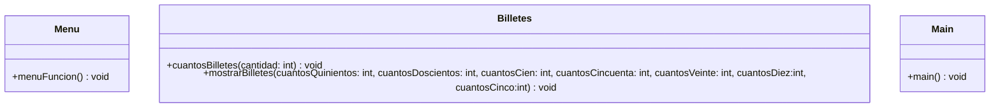

# Diagrama de clase



# Diagrama de flujo
```mermaid
graph TB
    inicio((Inicio))-->operacion
    operacion[/Operacion/] -->sacarDinero
    operacion[/Operacion/] -->salir
    sacarDinero{Retirar dinero}
    sacarDinero-->|Sí| cantidad -->multiplo
    cantidad[/Cantidad/]
    multiplo{Es múltiplo de 5?} -->|No|cantidad 
    multiplo --> |Sí| billetes
    billetes[Contar billetes]-->resultado
    resultado[\Total billetes\]-->operacion
    sacarDinero-->|No| salir 
    salir{Salir}-->|Sí| fin 
    salir{Salir}-->|No| sacarDinero
    
    fin((Fin))
    
